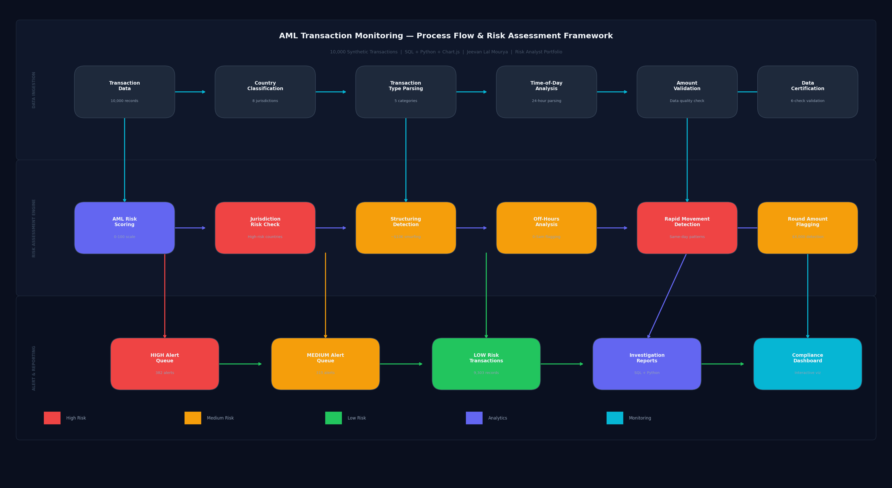

# AML Transaction Monitoring System
### Risk Analytics Portfolio | Jeevan Lal Mourya


### [▶ View Live Dashboard](https://jm5333.github.io/aml-transaction-monitoring/aml_dashboard.html)

> Built an AML transaction monitoring system that analyzes 10,000 synthetic financial transactions to detect suspicious patterns, flag high-risk jurisdictions, identify structuring attempts, and generate SAR-style compliance alerts — modeled after real AML monitoring logic used in banking operations.

---

## Process Flow



---

## Dashboard Preview


---

## Key Findings

| Metric | Result | What It Means |
|---|---|---|
| Suspicious Transaction Rate | 8.0% (800 of 10,000) | Above typical monitoring benchmark of 1–3% — stress scenario |
| HIGH Alerts | 382 | Require immediate investigation or SAR filing review |
| Suspicious Volume | $34.5M | Concentrated in CASH_OUT and TRANSFER types |
| RU/NG/IR Suspicious Rate | 15–17% | 3–4× the rate of US/UK transactions |
| Structuring Cases | 42 | Transactions just below $10K BSA reporting threshold |
| Off-Hours Suspicious Rate | 3× business hours | Common pattern in layering and placement typologies |

---

## Business Recommendations

Here's what the data actually suggests:

1. **RU, NG, IR corridors need enhanced due diligence** — suspicious rates of 15–17% vs 4–6% for US/UK. These aren't edge cases — they're a pattern. Any transaction from these jurisdictions above $5,000 should trigger automatic EDD review.

2. **CASH_OUT and TRANSFER are the problem types** — 100% of suspicious transactions fall into these two categories. PAYMENT, DEBIT, and CASH_IN show zero suspicious activity. A simple rule-based filter on high-value CASH_OUT + TRANSFER would catch most flagged cases.

3. **Automate SAR consideration for score ≥70 + structuring flag** — currently 42 structuring cases would qualify. Manual review at that volume is manageable, but as transaction volume scales, automation becomes necessary.

4. **Off-hours monitoring needs a dollar threshold** — suspicious rate is 3× higher between 12am–5am. A $5,000 cap on unverified accounts during off-hours would reduce high-risk exposure without blocking legitimate activity.

5. **November spike ($6.54M suspicious volume) warrants investigation** — highest month in the dataset. Worth checking whether a specific account cluster or corridor drove the increase.

---

## Python — How It Was Built

```python
import pandas as pd
import numpy as np

# AML Risk Scoring Function
def calculate_aml_risk(row):
    risk = 0
    # Jurisdiction risk (FATF high-risk countries)
    if row['country'] in ['RU', 'NG', 'IR']:  risk += 30
    # Large transaction threshold
    if row['amount'] > 50000:                  risk += 25
    # Off-hours activity
    if row['hour'] in [0,1,2,3,4,23]:          risk += 20
    # Structuring — BSA Section 5324 (smurfing)
    if row['structuring_flag'] == 1:           risk += 40
    # Rapid movement — layering pattern
    if row['rapid_movement_flag'] == 1:        risk += 25
    # Round amount — placement indicator
    if row['round_amount_flag'] == 1:          risk += 10
    return min(100, risk + np.random.randint(0, 5))

df['aml_risk_score'] = df.apply(calculate_aml_risk, axis=1)

# Alert classification
df['alert_level'] = pd.cut(
    df['aml_risk_score'],
    bins=[0, 39, 69, 100],
    labels=['LOW', 'MEDIUM', 'HIGH']
)

# Jurisdiction risk summary
jurisdiction = df.groupby('country').agg(
    tx_count=('transaction_id', 'count'),
    suspicious=('is_suspicious', 'sum'),
    volume=('amount', 'sum'),
    avg_risk=('aml_risk_score', 'mean')
).assign(
    suspicious_rate=lambda x: x.suspicious / x.tx_count * 100
).sort_values('avg_risk', ascending=False)

print(jurisdiction)
```

---

## AML Risk Scoring Framework

| Risk Factor | Weight | Basis |
|---|---|---|
| High-risk country (FATF: RU, NG, IR) | +30 pts | FATF country risk monitoring |
| Amount > $50,000 | +25 pts | FinCEN large transaction monitoring |
| Off-hours activity (12am–5am) | +20 pts | Unusual operational pattern |
| Structuring ($9,000–$10,000) | +40 pts | BSA Section 5324 — smurfing |
| Rapid movement flag | +25 pts | Layering typology |
| Round amount flag | +10 pts | Placement indicator |

### Alert Thresholds

| Level | Score | Action |
|---|---|---|
| HIGH ≥70 | SAR filing consideration | Immediate review |
| MEDIUM 40–69 | Enhanced due diligence | Compliance officer review |
| LOW <40 | Standard monitoring | Automated log |

### AML Typologies Covered

| Typology | Cases | Description |
|---|---|---|
| Structuring (Smurfing) | 42 | Just below $10K BSA threshold |
| Layering | 315 | Rapid TRANSFER + CASH_OUT sequences |
| Placement | 382 | Large CASH_IN from high-risk jurisdictions |

---

## SQL Queries

| Query | What It Shows |
|---|---|
| `1_aml_kpi_summary` | Top-line surveillance metrics |
| `2_suspicious_by_country` | Which countries are driving alerts |
| `3_risk_by_transaction_type` | CASH_OUT vs TRANSFER vs others |
| `4_structuring_detection` | BSA $10K threshold evasion cases |
| `5_off_hours_analysis` | Time-of-day risk breakdown |
| `6_monthly_trend` | 12-month suspicious activity trend |
| `7_data_validation` | 6-check data integrity suite |

---

## Methodology & Assumptions

| Assumption | Value | Why |
|---|---|---|
| Suspicious rate | 8% | Stress scenario — above typical 1–3% baseline |
| $10,000 threshold | BSA CTR boundary | BSA Section 5324 reporting requirement |
| High-risk countries | RU, NG, IR | Active FATF monitoring list |
| Off-hours window | 12am–5am | Standard AML banking monitoring practice |
| Dataset | 10,000 transactions | Mirrors PaySim (Kaggle) scale and structure |

---

## Repository Structure

```
aml-transaction-monitoring/
├── data/
│   └── aml_transactions.csv        # 10,000 synthetic transactions
├── sql/
│   └── aml_queries.sql             # 7 AML analysis queries
├── dashboard/
│   └── aml_dashboard.html          # Interactive monitoring dashboard
├── aml_process_map.png             # Workflow diagram
├── screenshot_aml.png              # Dashboard preview
└── README.md
```

---

*Fully synthetic dataset — no real customer or financial data used.*
*April 2026 | Risk Analytics Portfolio — Jeevan Lal Mourya | github.com/jm5333*
